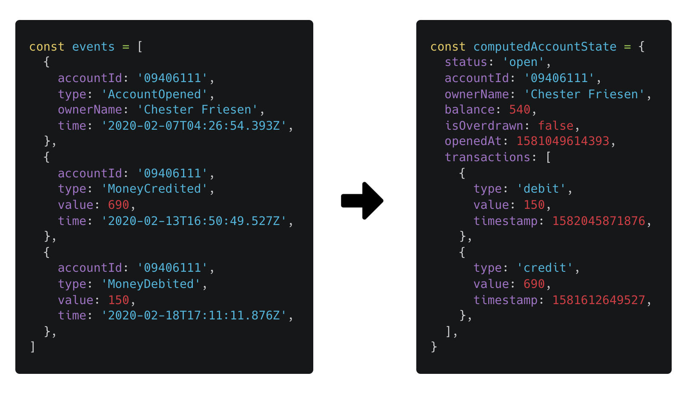

# Ticknovate developer test

This is a test for backend developers. It aims to have you demonstrate:

- TypeScript ability
- Familiarity with Node.js and Express
- Ability to transform data
- How you organise code

It is not intended to take more than **2 hours** to complete, but you are welcome to spend as much time on it as you like.

Code comments and feedback are welcome.

## Task

In the [events directory](./events) are JSON files representing events for bank accounts in a basic [event sourced system](https://www.eventstore.com/event-sourcing).

Using express, make 2 API endpoints:

1. **Get account:** An endpoint to get information about a specific bank account, including the current balance.
2. **Update account:** An endpoint to change the name of the account owner (the `ownerName` property).

To do this, you will need to load the relevant events and build a projection of the account, like in the example below.

The raw events (as stored in [events/09406111](./events/09406111)) are shown on the left, and the expected data shape that `GET /accounts/09406111` would respond with is shown on the right.

### Summary

Add the 2 API endpoints described above to this codebase to complete the test.
